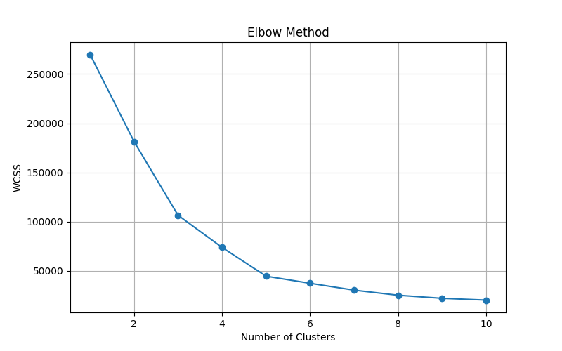
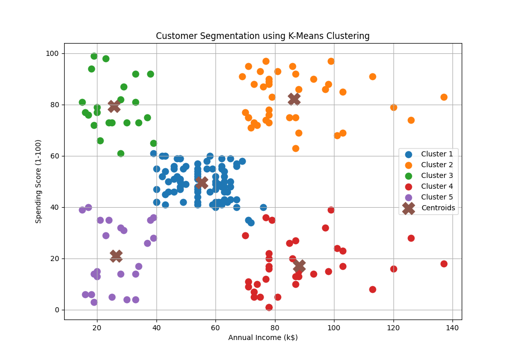

# Customer Segmentation using K-Means Clustering

## 📌 Project Overview

This project was developed as part of **Task 02** of the **Machine Learning Internship at Prodigy InfoTech**.

The objective is to segment retail store customers into distinct groups based on their purchasing behavior using the **K-Means Clustering Algorithm**. Customer segmentation helps businesses understand customer patterns and design targeted marketing strategies.

---

## 🎯 Objective

To group customers of a retail store based on:

* Annual Income (k$)
* Spending Score (1-100)

using the K-Means Clustering algorithm and identify meaningful customer segments.

---

## 📂 Dataset

**Dataset:** Mall Customer Segmentation Data

Source:
https://www.kaggle.com/datasets/vjchoudhary7/customer-segmentation-tutorial-in-python

The dataset contains information about customers, including:

* Customer ID
* Gender
* Age
* Annual Income (k$)
* Spending Score (1-100)

For clustering, the following features were selected:

* Annual Income (k$)
* Spending Score (1-100)

---

## 🛠️ Technologies Used

* Python
* Pandas
* NumPy
* Matplotlib
* Scikit-Learn
* Jupyter Notebook

---

## 📊 Project Workflow

### 1. Data Collection

* Loaded the customer dataset.
* Explored dataset structure and features.

### 2. Data Preprocessing

* Checked for missing values.
* Selected relevant numerical features.

### 3. Feature Selection

The following features were used for clustering:

* Annual Income (k$)
* Spending Score (1-100)

### 4. Finding Optimal Number of Clusters

Applied the Elbow Method to determine the optimal number of customer groups.

### 5. Model Training

Implemented K-Means Clustering using Scikit-Learn.

### 6. Customer Segmentation

Assigned customers to different clusters and visualized the results.

---

## 📈 Elbow Method

The Elbow Method was used to identify the optimal value of K (number of clusters).



---

## 📉 Customer Segments

The trained K-Means model segmented customers into distinct groups based on their income and spending behavior.



---

## 🔍 Business Insights

The clustering results help identify:

### Cluster 1

Customers with moderate income and moderate spending behavior.

### Cluster 2

High-income customers with high spending scores (premium customers).

### Cluster 3

Low-income customers with low spending scores.

### Cluster 4

High-income customers with low spending scores.

### Cluster 5

Low-income customers with high spending scores.

These insights can be used for:

* Personalized marketing campaigns
* Customer retention strategies
* Product recommendations
* Revenue optimization

---

## 📁 Project Structure

```text
PRODIGY_ML_02
│
├── data
│   └── Mall_Customers.csv
│
├── images
│   ├── elbow_method.png
│   └── clusters.png
│
├── notebooks
│   └── customer_segmentation.ipynb
│
├── customer_segmentation.py
├── requirements.txt
└── README.md
```

---

## 🚀 How to Run

### Clone Repository

```bash
git clone https://github.com/kapoorakshat2610-afk/PRODIGY_ML_02.git
```

### Install Dependencies

```bash
pip install -r requirements.txt
```

### Run Project

```bash
python customer_segmentation.py
```

---

## 🎓 Learning Outcomes

Through this project, I gained practical experience in:

* Unsupervised Machine Learning
* K-Means Clustering
* Customer Segmentation
* Data Visualization
* Elbow Method
* Business Data Analysis

---

## 🏢 Internship Information

**Company:** Prodigy InfoTech

**Domain:** Machine Learning Internship

**Task:** Task 02 - Customer Segmentation using K-Means Clustering

---

## 👨‍💻 Author

Akshat Kapoor

GitHub: https://github.com/kapoorakshat2610-afk

